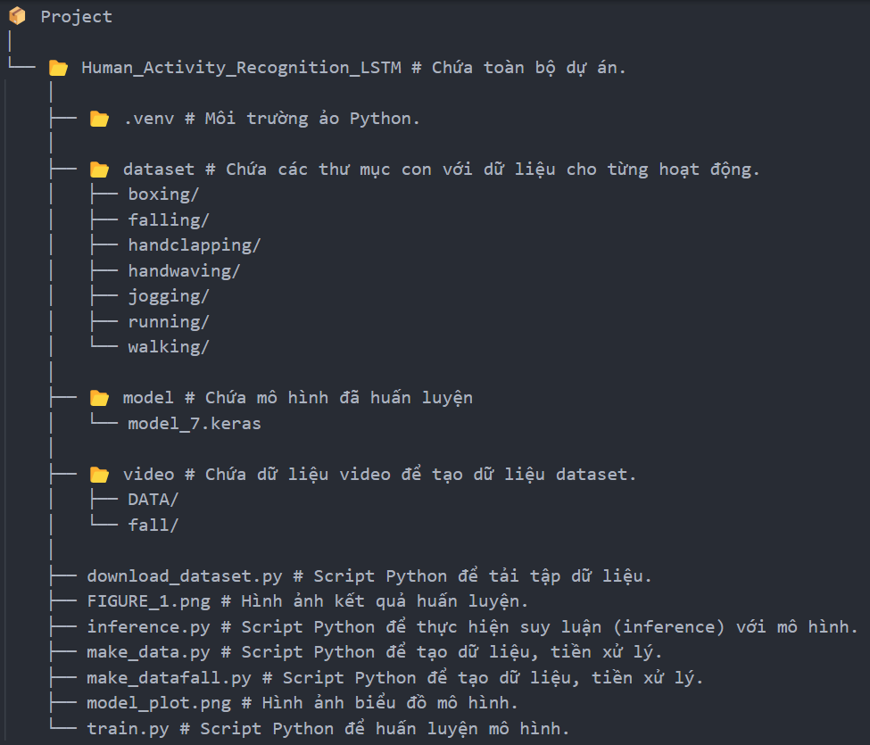
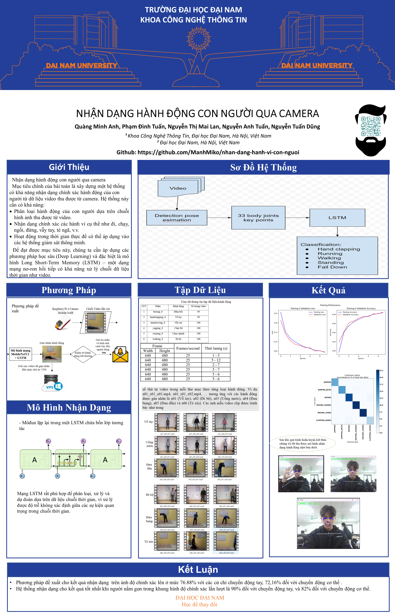

<h1 align="center">NHẬN DẠNG HÀNH VI CON NGƯỜI QUA CAMERA</h1>

<div align="center">

<p align="center">
  
  
</p>

[](https://www.facebook.com/DNUAIoTLab)
[](https://fitdnu.net/)
[](https://dainam.edu.vn)

</div>

<h2 align="center">Nhận dạng hành vi con người qua camera</h2>

<p align="left">
  Hệ thống nhận dạng hành vi con người qua camera là một ứng dụng sử dụng trí tuệ nhân tạo (AI) để phân tích hành động của con người trong thời gian thực. Dự án áp dụng mô hình deep learning để nhận diện các hành vi như đi, đứng, ngồi, ngã, đánh nhau, hoặc thực hiện các hành động bất thường. Hệ thống có thể được ứng dụng trong giám sát an ninh, hỗ trợ chăm sóc sức khỏe và tự động hóa trong các môi trường làm việc.
</p>

---

## 🌟 Giới thiệu

- **📌 Nhận diện hành vi thời gian thực:** Camera sẽ ghi lại và phân tích hành động của con người theo thời gian thực bằng mô hình deep learning.
- **💡 Cảnh báo tự động:** Nếu phát hiện hành vi bất thường (ngã, đánh nhau, bạo lực,...), hệ thống sẽ gửi cảnh báo.
- **📊 Lưu trữ dữ liệu:** Mọi hành vi được ghi nhận sẽ được lưu trữ trong cơ sở dữ liệu để phân tích sau này.
- **🖥️ Giao diện trực quan:** Hệ thống cung cấp giao diện hiển thị video trực tiếp kèm theo thông tin nhận diện hành động.

---
## 🏗️ HỆ THỐNG
<p align="center">
  
</p>

---
## 📂 Cấu trúc dự án

<p align="center">
  
</p>

---


## 🛠️ CÔNG NGHỆ SỬ DỤNG

<div align="center">

### 📡 Phần cứng
[]()
[]()
[]()
[]()
[]()

### 🖥️ Phần mềm
[]()
[]()
[]()
[]()

</div>

## 🛠️ Yêu cầu hệ thống

### 🔌 Phần cứng
- **Laptop** có GPU hỗ trợ tăng tốc học sâu (**NVIDIA RTX 3060 trở lên khuyến nghị**).
- **Camera độ phân giải Full HD (1080p trở lên)** để đảm bảo chất lượng nhận diện.
- **Ổ cứng SSD 512GB+** để lưu trữ dữ liệu và tăng tốc xử lý.
- **RAM tối thiểu 16GB** để chạy các mô hình deep learning hiệu quả.

### 💻 Phần mềm
- **🐍 Python 3+**
- **📦 TensorFlow, OpenCV, Flask** để xử lý hình ảnh và phát triển mô hình.
- **💻 PyCharm** để lập trình và kiểm thử.

---
### 📦 Các thư viện Python cần thiết
Cài đặt các thư viện bằng lệnh:

    pip install mediapipe opencv-python numpy tensorflow matplotlib pandas threading time shutil

---
## 🚀 Hướng dẫn cài đặt và chạy

1️⃣ **Tạo môi trường ảo và cài đặt các thư viện cần thiết**

```bash
python -m venv .venv
source .venv/bin/activate  # Trên macOS/Linux
.venv\Scripts\activate    # Trên Windows
pip install -r requirements.txt
```

2️⃣ **Tải dữ liệu huấn luyện**

```bash
python download_dataset.py
```

3️⃣ **Tạo dữ liệu huấn luyện từ video**

```bash
python make_data.py
python make_datafall.py
```

4️⃣ **Huấn luyện mô hình**

```bash
python train.py
```

5️⃣ **Chạy mô hình để nhận dạng hành vi**

```bash
python inference.py
```

---
## 📖 Hướng dẫn sử dụng
1️⃣ Chạy chương trình nhận dạng hành vi bằng lệnh:

```bash
python inference.py
```

2️⃣ Chọn nguồn video đầu vào (camera hoặc webcam).
3️⃣ Hệ thống sẽ hiển thị video trực tiếp kèm theo kết quả nhận dạng hành vi.
4️⃣ Nếu phát hiện hành vi (vỗ tay, vẫy tay, đấm bốc, chạy, đi bộ...), hệ thống sẽ hiển thị cảnh báo theo thời gian thực.

---
## ⚙️ Cấu hình & Ghi chú

- **Yêu cầu phần cứng:** GPU, RAM tối thiểu 8GB.
- **Phần mềm:** Python 3.8+, TensorFlow 2.x, OpenCV, MediaPipe.
- **Lưu ý:** Nếu gặp lỗi khi chạy mô hình, hãy kiểm tra phiên bản thư viện và cài đặt lại.

---
## 📰 Poster
<p align="center">
  
</p>

---
## 🤝 Đóng góp
Dự án được phát triển bởi 5 thành viên:

| Họ và Tên         | Vai trò                                                        |
|-------------------|----------------------------------------------------------------|
| Quàng Minh Anh    | Phát triển mã nguồn, huấn luyện mô hình AI, kiểm thử hệ thống. |
| Nguyễn Thị Mai Lan| Biên soạn tài liệu, thiết kế giao diện web.                    |
| Nguyễn Anh Tuấn   | Thu thập tài liệu, viết báo cáo, thiết kế latex.               |
| Phạm Đình Tuấn    | Thu thập, trình bày và tiền xử lý dữ liệu.                     |
| Nguyễn Tuấn Dũng  | Tìm kiếm dữ liệu, hỗ trợ triển khai hệ thống.                  |

© 2025 NHÓM 8, CNTT16-05, TRƯỜNG ĐẠI HỌC ĐẠI NAM
